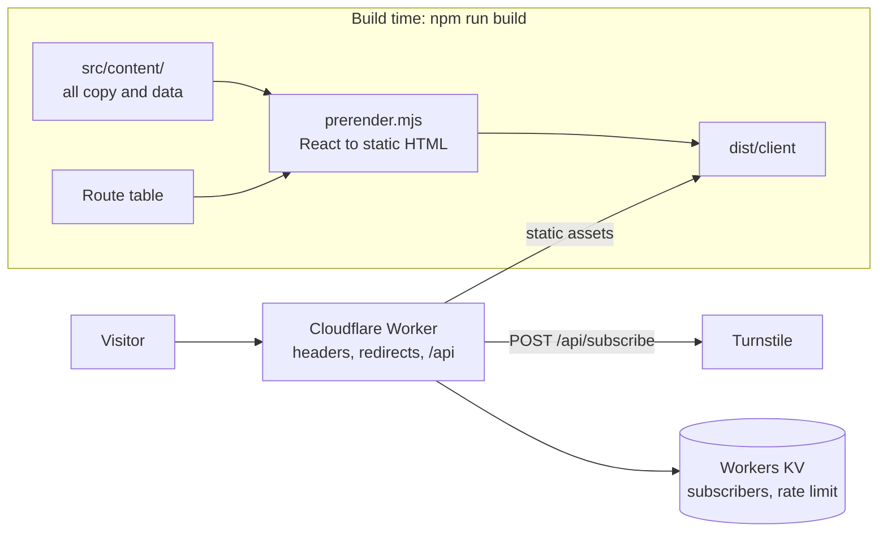

<div align="center">

# Vroe Labs

**The website for a product studio that is building Trove and Vero.**

Prerendered static HTML on Cloudflare Workers. No React reaches the browser.

[vroelabs.com](https://vroelabs.com) · [Documentation](AGENTS.md) · [Security](SECURITY.md) · [Contributing](CONTRIBUTING.md)


</div>

## Why this exists

Vroe Labs is building two products, and neither has shipped. This site is where
the studio says so plainly: what each product is meant to do, where it stands,
and, for Trove, the sourced evidence behind the problem it targets.

The engineering goal follows from that. A mostly static marketing site should
ship almost no JavaScript, be readable by crawlers on every route, and hold a
strict security policy. It ships **2.2 KB** of gzipped JavaScript, under a
Content Security Policy with no `unsafe-inline` and no `unsafe-eval`.

## What it does

| Capability | How |
| --- | --- |
| Ten static routes: home, `/products`, `/trove`, `/vero`, two notes, about, contact, privacy, terms | Every route is rendered to a real HTML file at build time from one route table |
| An evidence layer on `/trove` | Sourced, dated figures on the cost of managing personal finances (India and the United States, 2024 or later). A test recomputes every figure from its source data, and the build fails if one cannot be |
| An early-access form | One Worker endpoint: same-origin check and honeypot, per-IP rate limit, Turnstile bot check, and the email stored under a hashed key in Workers KV |
| Honest product status | Neither product is presented as available: no external links, no `offers` in structured data. Tests fail the build on invented ratings, offers or counts |
| Enforced budgets | Byte budgets for JavaScript, CSS, HTML, fonts and images run in `npm test`; Lighthouse runs in CI |

## Architecture



React is a build-time template engine here. Components are pure functions, the
browser receives HTML and CSS plus one small enhancement script, and every
dependency is a `devDependency` because nothing else ships. The Worker runs
first on every request, so the security headers reach HTML, assets and errors
alike. The reasoning is in the
[system document](SYSTEM.md).

## Tech stack

| Layer | Technology | Purpose |
| --- | --- | --- |
| Rendering | React 19, esbuild | Components rendered to static HTML at build time |
| Bundling | Vite | Styles and the one client script |
| Images and fonts | sharp, self-hosted fonts | AVIF, WebP and JPEG variants; no third-party font requests |
| Runtime | Cloudflare Workers with static assets | Serves the site, sets security headers, hosts `/api/*` |
| Storage | Cloudflare Workers KV | Subscriber list and rate limiting |
| Bot protection | Cloudflare Turnstile | Guards the subscribe form |
| CI/CD | GitHub Actions | Build, test, audit, SBOM, deploy with automatic rollback, scheduled health check |
| Quality | Node test runner, Lighthouse | 11 test suites and performance budgets |

## Getting started

Requires Node 22 or newer.

```bash
cd code             # the buildable app lives here, not the repo root
npm ci
npm run build
npm run preview     # the real Worker on http://localhost:8787 (next free port if taken)
```

### Environment variables

Nothing is read at build time. To exercise the subscribe form locally, put the
variables you need in `code/.dev.vars`, which is gitignored.
[`code/.env.example`](code/.env.example) lists every variable the project uses,
which are public and which are secret, with placeholder values only. Never
commit a real value.

## Development

| Command | Does |
| --- | --- |
| `npm run build` | Fonts, images, Vite, prerender, sitemap |
| `npm test` | Every suite: worker, security, functionality, SEO, evidence, performance, docs, accessibility, backup |
| `npm run test:security` | Headers, CSP, subscribe pipeline, build hygiene |
| `npm run perf` | Lighthouse budgets against the preview (needs Chrome and `cd perf && npm ci`) |
| `npm run audit:deps` | `npm audit --audit-level=high` |
| `npm run backup` | Copy the subscriber list to the maintainer's computer; see [RUNBOOK](RUNBOOK.md) |
| `npm run deploy` | Build and deploy to Cloudflare |

Finish a change with `npm run build && npm test && npm audit --audit-level=high`.
A pull request must pass the `verify` and `docs-impact` checks, and the
documentation changes in the same pull request as the code.

## Project structure

```text
code/                  buildable app
├── src/content/       all copy and metadata; never hard-code copy in a component
│   └── evidence/      sources, metrics, figures, derivations
├── src/pages/         one component per page type
├── src/styles/        tokens, fonts, base, layout, components, responsive
├── src/client/        enhance.js, the only JavaScript that reaches the browser
├── worker/            Cloudflare Worker: routing, /api, security headers
├── scripts/           build pipeline, backup, docs check
└── tests/             worker, security, SEO, evidence, budgets, docs
*.md                   WOLF kit docs at the root; start at AGENTS.md
docs/03_RESEARCH/      the research record and source files behind /trove
.github/workflows/     ci, deploy, health check, docs-impact
```

## Documentation

The documentation follows the WOLF kit layout: one root file per concern.
[AGENTS.md](AGENTS.md) is the entry point, with the commands and the project rules.

- [PRODUCT.md](PRODUCT.md): what the site is, its pages, the honesty rules and the design tokens
- [SYSTEM.md](SYSTEM.md): architecture, data, endpoints, security headers and the CSP
- [RUNBOOK.md](RUNBOOK.md): commands, deploy, rollback, backups and what to do when something breaks
- [GROWTH.md](GROWTH.md): SEO, the page log and what is measured
- [Research](docs/03_RESEARCH/RESEARCH.md): the evidence behind `/trove`, and its sources
- [DECISIONS.md](DECISIONS.md) and [MISTAKES.md](MISTAKES.md): every non-obvious choice, and every lesson

## Products

Both are in progress, and the site says so on every page that mentions them.

- **Trove**, personal finance. Status: *Taking shape*. Not yet available.
- **Vero**, verified work history. Status: *Upcoming*. An exploration, not a product.

## Security

Strict CSP, the full security header set on every response, Turnstile and rate
limiting on the one write endpoint, and no secrets in the repository. Report a
vulnerability privately via [SECURITY.md](SECURITY.md); please do not open a
public issue.

## Contributing

Read [CONTRIBUTING.md](CONTRIBUTING.md) first. Participation is governed by the
[Code of Conduct](CODE_OF_CONDUCT.md).

## Licence

Source code: [MIT](LICENSE). The Vroe Labs name, brand assets, copy and
photography are © Vroe Labs and not covered by that licence; see [NOTICE](NOTICE).
